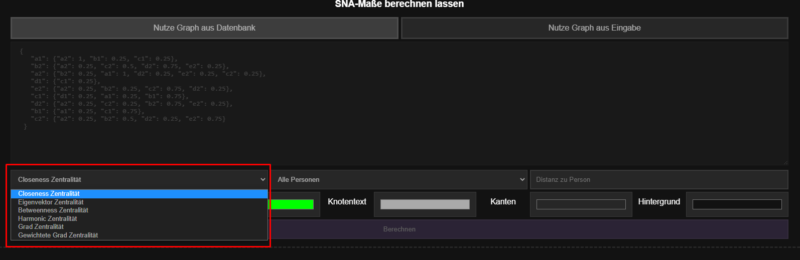

# Webpage for administration

Returns a webpage to test basic functionality of the backend of this webapp.
In the following sections the usage for this webpage is explained.

**URL** : `/admin`

**Method** : `GET`

**Auth required** : Yes

## Authentication
The webpage is secured by a basic username and password. Those can be set in the `config.xml`. How to set those is explained in the [README](../README.md).
You should see a pop-up window similiar to this one  
  
Enter your username and password and you should be given access to the webpage.  
**NOTE** again that those credentials will not be encrypted and sent via http meaning they are very vulnerabel to Man-in-the-middle attacks.

## Success Response after Login 

**Code** : `200 OK`

**Content examples**

This is the webpage you will see after the login.

### Add interactions
There are three main areas which we will discuss briefly. In the upper part of the webpage you can add interactions manually to the database.   
You can do that by entering the IDs (or Names, depending on what you store in your database) and separating them by a comma. Afterwards you should enter the duration of the interaction and click the button with the text `Hinzufügen`.  
A successful request should look like this  

### Delete Interactions
If you want to delete a persons interaction from the database you can do so by the next part of the webpage. Just enter their ID and hit the button with the text "Löschen".
If this succes you should look at a screen similiar to this one.  

### Social network analysis
The last and biggest part is the part where you can actually use the analysing functionalities of our application.
You can do this analysis with the interaction graph generated from the interacitons stored in the database or enter a custom graph in a JSON format.
How to do this is explained in the documentation for the `/api/network-analysis` route [here](network-analysis.md).  

This can be done by selecting either of those *switching labels*

After this selection you can choose which centrality type you want to calculate. This selection is done via a *choicebox*, which can be seen here

After that selection you are ready to go and can hit the button with the text `Berechnen`. This will calculate the graph for the selected centrality type and visualize it in the specified colors. The colors are arbitrary and you can choose them to your liking.  

The graphs of those networks tend to get pretty big. Therefore we implemented a feature for you to only display a subgraph. You can choose a person with the choicebox next to the previous used choicebox. This will select a single person. With no further specification only this person will be displayed. To expand the visualized graph you can select a maximum distance other nodes are allowed to be distanced from your selected one in order to still be visualized.

For example this is a complete Graph calculated with no specific person selected.

If you select `a1` as a person and specify no maximum distance this is the resulting graph.  
  
Note that his is the entire SVG generated by our frontend and not just a sub section of the previous screen shot.

Now you could allow nodes within a specified distance to also be drawn thus expanding the visualized graph step by step.
This is an example for such a selection where the person `a1` with a maximum distance of `1` is selected.  

This will result in the following graph.  

### Exporting the SVGs
Last but not least to export these generated visualization of the graph we implemented a button that allows you to download them as an SVG.
This button can be found when looking at a graph in the bottom left corner.  

## Notes

This route was much fun to write :)
