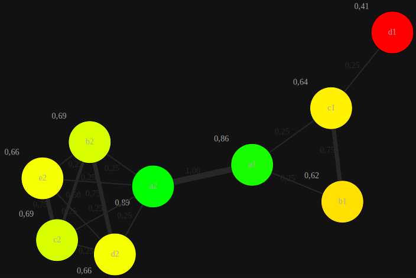

# Get graph depicted in SVG 

Get an SVG file that visualizes the graph and data obtained from the social network analysis.

**URL** : `/api/graph-svg`

**Method** : `POST`

**Auth required** : No

**Required Body**
```json
{
  "centrality": "On of [closeness, betweenness, eigenvector, harmonic, degree, weighteddegree]",
  "display": "A valid ID",
  "distance": "Any natural number as a String",
  "colors": {
    "node_color_min": "RGB-Hex-Value ",
    "node_color_max": "RGB-Hex-Value ",
    "node_fontcolor": "RGB-Hex-Value ",
    "edge_color": "RGB-Hex-Value ",
    "edge_fontcolor": "RGB-Hex-Value ",
    "graph_bgcolor": "RGB-Hex-Value "
  }
}
```
Whereas `centrality` is a required field all others are optional parameters.
When an id is selected via the `display` field only that node and all nodes within range of `display` steps are visualized.
If no range is specified via the `distance` field only the one node will be drawn.  

The `colors` field specifies in which color certain parts of the SVG are colored.
 * node_color_min - Color for nodes with a low centrality
 * node_color_max - Color for nodes with a high centrality
 * node_fontcolor - Color of the text within and next to the nodes
 * edge_color     - Color of the edges between nodes
 * edge_fontcolor - Color of the text next to the edges
 * graph_bgcolor  - Background color for the whole SVG

**Data example**
```json
{
  "centrality": "closeness",
  "colors": {
    "node_color_min": "#ff0000",
    "node_color_max": "#00ff00",
    "node_fontcolor": "#aaaaaa",
    "edge_color": "#272727",
    "edge_fontcolor": "#272727",
    "graph_bgcolor": "#121212"
  }
}
```

## Success Response

**Code** : `200 OK`

**Content example**

```xml
<?xml version="1.0" encoding="UTF-8"?>
<!DOCTYPE svg PUBLIC "-//W3C//DTD SVG 1.1//EN" "http://www.w3.org/Graphics/SVG/1.1/DTD/svg11.dtd">
<!-- Generated by graphviz version 2.43.0 (0) -->
<!-- Title: G Pages: 1 -->
<svg xmlns="http://www.w3.org/2000/svg" xmlns:xlink="http://www.w3.org/1999/xlink" width="555pt" height="714pt" viewBox="0.00 0.00 555.41 714.44">
    <g id="graph0" class="graph" transform="scale(1 1) rotate(0) translate(4 710.44)">
        <title>G</title>
        <polygon fill="#121212" stroke="transparent" points="-4,4 -4,-710.44 551.41,-710.44 551.41,4 -4,4" />
        <!-- a1 -->
        <g id="node1" class="node">
            <title>a1</title>
            <ellipse fill="#1aff00" stroke="black" cx="323.82" cy="-413.57" rx="36" ry="36" />
            <text text-anchor="middle" x="323.82" y="-409.87" font-family="Times,serif" font-size="14.00" fill="#aaaaaa">a1</text>
            <text text-anchor="middle" x="271.82" y="-453.37" font-family="Times,serif" font-size="14.00" fill="#aaaaaa"></text>
                                         ...
        </g>
    </g>
</svg>
```



## Error Response

**Condition** : Body misses field centrality (Error 1) or has invalid values (Error 2)

**Code** : `400 BAD REQUEST`

**Content** :

Error 1
```json
{
  "error": "Body is not of expected type JSON object"
}
```

Error 2
```json
{
  "error": "Specified centrality not implemented"
}
```

## Notes
This route is very fragile. It does not cover a lot of safety as it was only intended to be used by the frontend i.e. with
automated request where the body is always of a valid format with valid values.